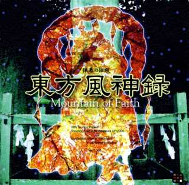

# Touhou10-dqn  
  
This project is focusing on DQN AI for the bullet hell games from Touhou 10 - Mountaion of Faith, using PyTorch.  
Because it is on progress, it would be not perfect.
  
Inspired by
- [TH10_DataReversing](https://github.com/binvec/TH10_DataReversing)
- [TouhouCV](https://github.com/Netdex/touhoucv)
- [deep-learning-bullet-hell-environment](https://github.com/michael-pacheco/deep-learning-bullet-hell-environment)  
  
  
[First Trial(youtube)](https://www.youtube.com/watch?v=mXCZ-Z84-iI&feature=youtu.be)  

## Environment
- Windows 10
- Anaconda 4.5.11
- python 3.6

## How it works
Like other deep q-learning examples, it takes a game screenshot from th10.exe at real time(th10/game.py) and 
treat it as a deep learning model input. 

## Before Run
1. You must have touhou 10.0 - Mountaion of Faith
2. Before run train.py, There must be th10.exe on your processes
3. Before run train.py, enter 'game start' or 'practice start' 
